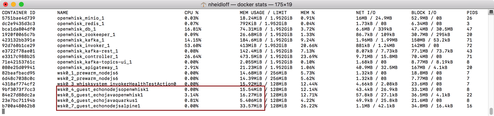

# OpenWhisk Functions with Java and JavaScript

In the cloud you typically pay by the amount of memory your code needs and how long the code runs. This project contains a little experiment to compare how much memory functions require which run on [Apache OpenWhisk](https://openwhisk.apache.org/) and have been implemented with Java and JavaScript.

There are five different types of functions:

* JavaScript functions as OpenWhisk provides them out of the box
* Java functions as OpenWhisk provides them out of the box
* Java functions using [Quarkus](https://quarkus.io/)
* JavaScript functions using node:8-alpine
* Java functions using a classic JavaEE stack

*Note:* This is just a quick experiment. Draw your own conclusions.


## Prerequisites

Get a free [IBM Cloud Lite](https://ibm.biz/nheidloff) account.

Make sure you have the following prerequisites installed:

* [ibmcloud](https://console.bluemix.net/docs/openwhisk/bluemix_cli.html#cloudfunctions_cli) CLI and ibmcloud fn plugin
* [node](https://nodejs.org/en/download/)

Follow the [instructions](https://quarkus.io/guides/building-native-image-guide) on the Quarkus web site how to set up GraalVM, a Java JDK and Maven.

Login to the IBM Cloud and Docker Hub:

```
$ ibmcloud login
$ docker login
```


## Build and run Functions on IBM Cloud Functions


**Node.js OpenWhisk Functions**

```
$ scripts/create-function-nodejs-openwhisk.sh
$ node scripts/invoke-function-nodejs-openwhisk.js
$ scripts/delete-function-nodejs-openwhisk.sh
```


**Java OpenWhisk Functions**

```
$ mvn -f java-openwhisk/pom.xml package
$ scripts/create-function-java-openwhisk.sh
$ node scripts/invoke-function-java-openwhisk.js
$ scripts/delete-function-java-openwhisk.sh
```


**Node.js Alpine Functions**

Use your Docker name instead of 'nheidloff'.

```
$ docker build -f ./nodejs-alpine/Dockerfile -t nheidloff/echo-nodejs-alpine:1 .
$ docker push nheidloff/echo-nodejs-alpine:1
$ scripts/create-function-nodejs-alpine.sh
$ node scripts/invoke-function-nodejs-alpine.js
$ scripts/delete-function-nodejs-alpine.sh
```


**Java Quarkus Functions**

Use your Docker name instead of 'nheidloff'.

```
$ mvn package -f ./java-quarkus/pom.xml -Pnative -Dnative-image.docker-build=true
$ docker build -f ./java-quarkus/Dockerfile -t nheidloff/echo-java-quarkus:1 .
$ docker push nheidloff/echo-java-quarkus:1
$ scripts/create-function-java-quarkus.sh
$ node scripts/invoke-function-java-quarkus.js
$ scripts/delete-function-java-quarkus.sh
```


**Java JEE Functions**

Use your Docker name instead of 'nheidloff'.

```
$ mvn package -f ./java-jee/pom.xml 
$ docker build -f ./java-jee/Dockerfile -t nheidloff/echo-java-jee:1 .
$ docker push nheidloff/echo-java-jee:1
$ scripts/create-function-java-jee.sh
$ node scripts/invoke-function-java-jee.js
$ scripts/delete-function-java-jee.sh
```


## Run Functions locally in Docker


**Node.js Alpine Functions**

```
$ docker run -i --rm -p 8081:8081 -m 128MB --name echo-nodejs-alpine nheidloff/echo-nodejs-alpine:1
$ curl --request POST \
  --url http://localhost:8081/run \
  --header 'Content-Type: application/json' \
  --data '{"value":{"name":"Niklas"}}'
```


**Java Quarkus Functions**

```
$ docker run -i --rm -p 8080:8080 -m 128MB --name echo-java-quarkus nheidloff/echo-java-quarkus:1
$ curl --request POST \
  --url http://localhost:8080/run \
  --header 'Content-Type: application/json' \
  --data '{"value":{"name":"Niklas"}}'
```


**Java JEE Functions**

```
$ docker run -i --rm -p 9080:9080 --name echo-java-quarkus nheidloff/echo-java-jee:1
$ curl --request POST \
  --url http://localhost:9080/run \
  --header 'Content-Type: application/json' \
  --data '{"value":{"name":"Niklas"}}'
```


## Run Functions locally in OpenWhisk

Follow the [instructions](https://github.com/apache/incubator-openwhisk-devtools/blob/master/docker-compose/README.md) to set up OpenWhisk locally.

Build the images as described above.

Once OpenWhisk is running locally, invoke these commands to create the functions.

```
$ scripts-local/create-function-nodejs-openwhisk.sh
$ scripts-local/create-function-nodejs-alpine.sh
$ scripts-local/create-function-java-openwhisk.sh
$ scripts-local/create-function-java-quarkus.sh
```

To generate some workload, run this command:

```
$ node scripts-local/create-load.js
```

In a separate terminal run this command:

```
$ docker stats
```

<kbd></kbd>